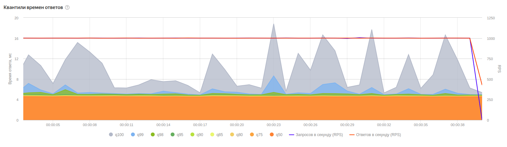
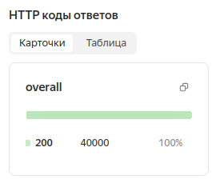
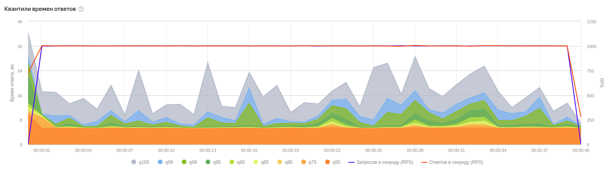
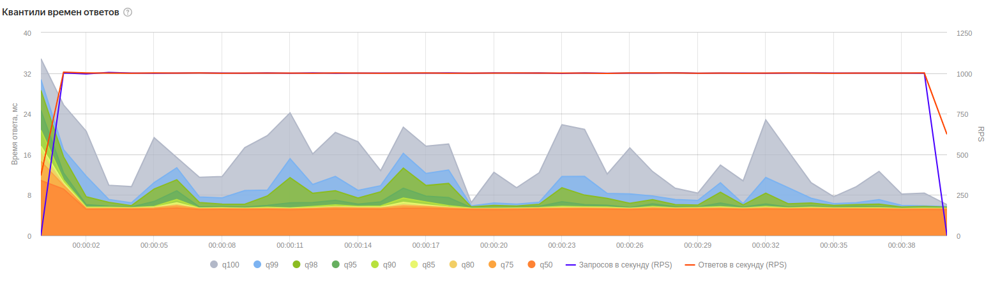
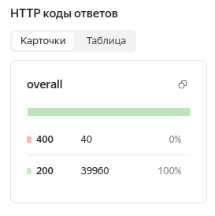
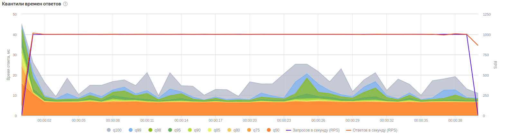
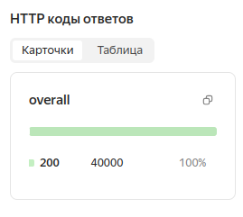

# 📊 Нагрузочное тестирование

## 🛠 Инструменты
- **[Yandex.Tank](https://yandextank.readthedocs.io/en/latest/)** - OpenSource-решение для нагрузочного тестирования
- **Phantom** - высокопроизводительный генератор нагрузки

## 🚀 Оптимизации
- `pg_bouncer` - пул соединений PostgreSQL
- `sha256 вместо bcrypt` - ускорение аутентификации

## ⚙ Параметры теста
- **Нагрузка:** const 1000 RPS
- **Длительность:** 40 секунд
- **Сервер**: VPS 16CPU 32RAM. Зона ru-7

---

## 🔐 POST /api/auth
**Payload:**
```json
{
    "username": "user{i}",  // Инкрементируемое значение
    "password": "pass"
}
```

**Результаты:**
| Метрика               | Значение  |
|-----------------------|-----------|
| Макс. время ответа    | 19 ms     |
| Успешные запросы      | 100% (200)|




---

## 🛒 GET /api/buy/:item
**Особенность:** Все пользователи получили `1e8` монет 💰  
**Payload:** [ammo_buy_item.txt](./ammo/buy_item.txt)

**Результаты:**
| Метрика               | Значение  |
|-----------------------|-----------|
| Макс. время ответа    | 28 ms     |
| Успешные запросы      | 100% (200)|




---

## 💸 POST /api/sendCoin
**Payload:** [ammo_send_coins.txt](./ammo/ammo_send_coins.txt)

**Результаты:**
| Метрика               | Значение    |
|-----------------------|-------------|
| Макс. время ответа    | 24 ms       |
| Успешные запросы      | 99.9% (200) |
| Ошибки                | 0.1% (400)  |

> **Примечание:** Один запрос вернул 400 из-за ошибки генерации данных (попытка самопополнения)




---

## GET /api/info
**Payload:** [ammo_info.txt](./ammo/ammo_info.txt)

**Результаты:**
| Метрика               | Значение  |
|-----------------------|-----------|
| Макс. время ответа    | 25 ms     |
| Успешные запросы      | 100% (200)|




---

## 📈 Результаты

| Эндпоинт          | Нагрузка (RPS) | Длительность | Макс. время ответа | Успешные запросы | Ошибки       |
|--------------------|----------------|--------------|--------------------|-------------------|--------------|
| POST /api/auth     | 1000           | 40s          | 19 ms              | 100% (200)        | 0%           |
| GET /api/buy/:item | 1000           | 40s          | 28 ms              | 100% (200)        | 0%           |
| POST /api/sendCoin | 1000           | 40s          | 24 ms              | 99.9% (200)       | 0.1% (400)   |
| GET /api/info      | 1000           | 40s          | 25 ms              | 100% (200)        | 0%           |

**Ключевые выводы:**
- Все эндпоинты выдержали нагрузку 1000 RPS
- Максимальное время ответа не превысило 30 мс